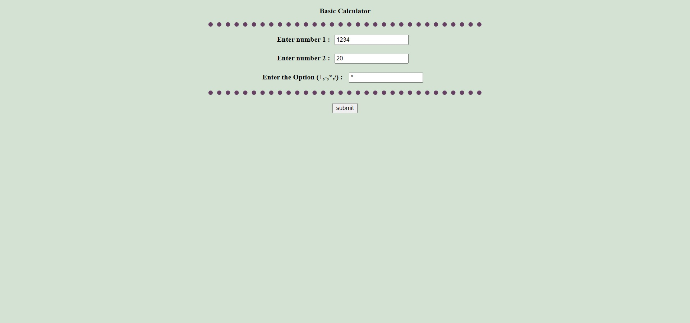
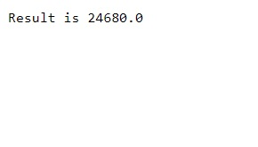

## A simple function webpage to perform basic calculator operations

### Languages used 
  1. Java
  2. Servlet
  3. HTML5
  4. CSS
  
### Requirments to run this program 
  
  1. IDE to run Java EE programs
  2. Any servers to host your files (Here I used Apache Tomcat v9.0)

### Screenshots

### Providing input to the wepage

### Getting output on the webpage

